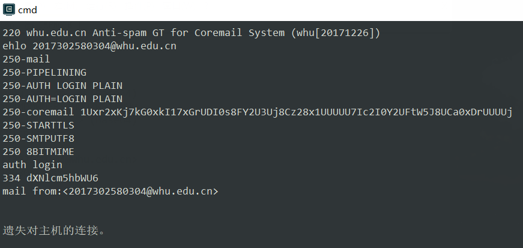
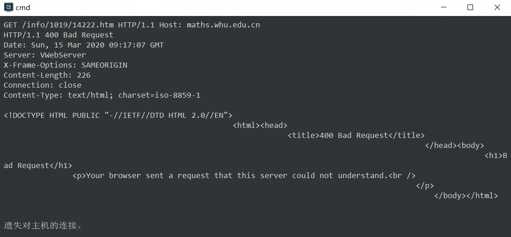

# 第二章习题

## P5

**a.** 我们可以从服务器的响应消息中看出，本消息的HTTP响应状态码为200 OK，说明服务器成功找到了客户端请求的文档。从首部字段名`Date`的值中，我们得知该文档提供回答的时间是2008年3月7日12时39分45秒。

**b.** 从首部字段名`Last-Modified`的值中，我们可以得出该文档最后的修改时间为2005年12月10日18时27分46秒。

**c.** 从首部字段名`Content-Length`的值中，我们得知文档中被返回有3874个字节。

**d.** 文档被返回的前5个字节为：`<!doc`。由于首部字段名`Connection`的值为`Keep-Alive`，故该服务器同意一条持续连接。

## P9

**a.** 首先计算跨入接入链路发送一个对象的平均时间 $\Delta$ 为：

$$\Delta = 850000bite \div 15Mbps = 850000bite \div 15728640bps \approx 0.054s$$

然后已知平均请求率$\beta = 16 requests/s$，可计算得到平均接入时延$t_{接入时延}$为：

$$t_{接入时延} = \Delta / (1-\Delta\beta) = 0.054s / (1-0.864) \approx 0.397s$$

故总的平均响应时间为：

$$t_{总} = t_{接入时延} + t_{因特网时延和} = 3s + 0.397s = 3.397s$$

**b.** 由于缓存器的命中率为0.4，则需要链入源服务器请求的数目为原来的0.6，平均接入时延$t_{接入时延}$为：

$$t_{接入时延} = \Delta / (1-\Delta\beta) = 0.054s / (1-0.6 \times 0.864) \approx 0.112s$$

由于计算响应时间时不考虑LAN时延，即从缓存器响应时延$t_{缓存器}=0$，总的响应时间$t_{总}$为：

$$t_{总} = 0.4 \times  t_{缓存器} + 0.6 \times (t_{接入时延} + t_{因特网时延和}) = 0.4 \times 0 + 0.6 \times (0.112 + 3) = 1.8672s$$

## telnet

### SMTP

使用telnet登录武大服务器(whu.edu.cn)的SMTP端口25。但在实验过程中经常与服务器断开连接，错误解析指令或者对某些指令无法正常运行。最开始尝试使用telnet发送邮件时还能进行到编写邮件阶段然后断开了连接，后来就到指定邮件发送者后就连接就自动断开。截图如下：

### HTTP
使用telnet登录武大服务器(maths.whu.edu.cn)的HTTP端口80。在实验过程中一直显示请求为`Bad Request`，无法正常返回请求文档。

