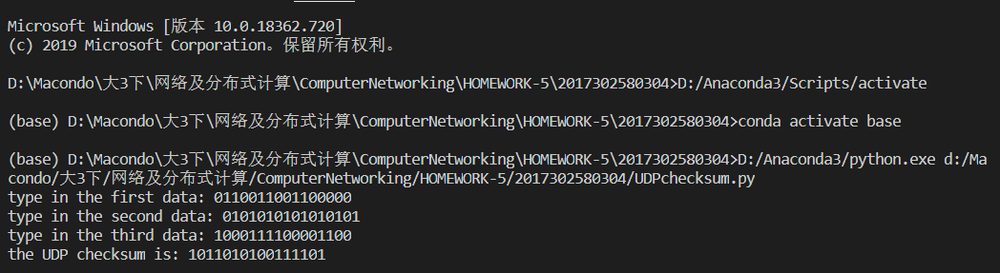

# 第三章练习题

## P7

对于这个问题，我们首先要考虑的是为分组加序号的原因，即通过分组来确认当前接收到的分组是否与前一分组重复，避免出现错误的重复操作，比如在接收方接收到重复的报文段导致同一数据解析发送到上层两次。而对于ACK分组，接收方在正确接收到一个ACK分组后就进入了下一个状态，若接收有重复发送的ACK分组也不会对其做出响应。所以再rdt3.0协议中，这些ACK分组不需要序号。

## P10

在使用能够丢失分组并且最大时延已知道的信道时，我们在rdt2.1协议的基础上再增加一个计时器。对于**发送方**：当rdt_send(data)事件发生时，计时器就开始计时(start_timer)，同时在状态“等待ACK或NAK 0”与“等待ACK或NAK 1”返回自身的响应事件中添加超时事件(timeout)，超时事件发生后将重新发送最近发送的数据包。对**于接收方**不做任何改变。然后我们来考虑其如何在丢失分组的情况下工作：

1. 当发送方发送的数据包丢失时，超时事件响应，发送方重新发送最近发送的数据包。而对于接收方，其从未接受到数据包，则对于其而言这就是正常的传输数据包。
2. 当接收方返回的ACK或者NAK包丢失时，超时事件响应，发送方重新发送最近发送的数据包。发送方接收到前一数据包的副本，则返回ACK包确认接收，以通知接收方成功接受到正确的数据包。这与发送方接收到错误的ACK包时响应情况一模一样。

## UDP检验和

求UDP检验和的python源码在文件`UDPChecksum.py`中，以下为课本3.3.2中数据的检验结果。

